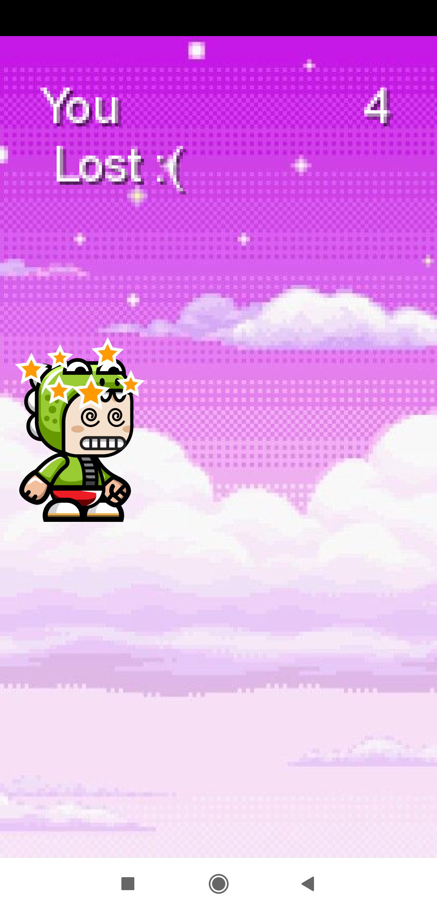

# coinman-android-game

An android game using a 2D physics library (libGDX) and Java.

# libGDX

LibGDX is a free, open source cross platform game development framework. The goal of the project is to assist you in creating games/applications and deploy to desktop and mobile platforms without getting in the way and letting you design however you like.
LibGDX is free, licensed with Apache 2 open source software license, allowing everyone to use this project.

# Screenshots

